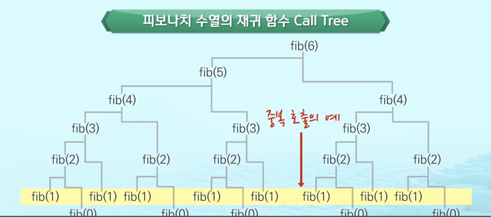

# 수업 

## stack

- 파이썬에서는 리스트 같은 것으로 활용
- C 나 java 에서는 따로 스택이라는 자료구조를 만들어서 사용함

리스트 =[] 앞에서 부터 차근차근 데이터를 집어넣음. 오른쪽으로 하나씩 더하고 뽑아낼 때도 오른쪽에서 하나씩 뻄.
-> 후입선출
pop 을 사용하면 뒤에서 부터 삭제됨 !
비어있는 리스트에서는 pop 오류 뜸 
isEmpty ( 스택이 공백인지 아닌지를 확인 ): 파이썬에서는 len 으로 0인지 아닌지로 확인 

#### stack 응용

ex) 예시 
괄호 매칭: 괄호가 한 쌍이 되어야 처리가 됨.ex) 코드에서 괄호매칭때문에 에러가 뜨는 경우, 함수에서 괄호가 닫혀야 함수가 실행이 됨.

### memoization
수업시간에 직접 구현해봄. 

이렇게 fib(n)을 실행할 떄 중복해서 똑같은 fib(m)이 호출되고 있음.
한번 fib(n)이 구해지면 리스트에 저장을 해서 다시 호출될 필요가 없어지면 시간이 절약됨.


```python
memo = [1, 1] # f(0), f(1)을 저장해놓고 f(2), f(3) ... 을 순차대로 저장함

def fibo(n):
    if n >= 2 and len(memo) <= n:
        memo.append(fibo(n-1) + fibo(n-2))
    return memo[n]

print(memo)
print(fibo(100))
```

### DP(동적계획법)
작은 것 먼저 해결하고 그것들을 이용하여 큰 문제를 해결.


### DFS(깊이 우선 탐색) -> 영상 다시 보기 

- 인접행렬방식: 행렬에서 연결되어있는 수가 만나는 지점에 1
- 인접리스트방식: 인접 가능한 노드를 각각의 리스트로 표현