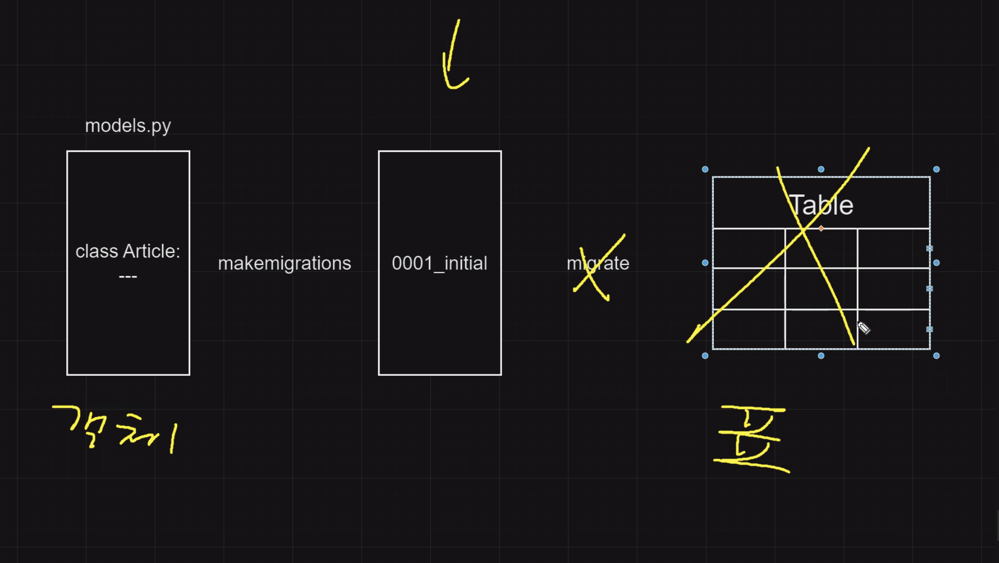
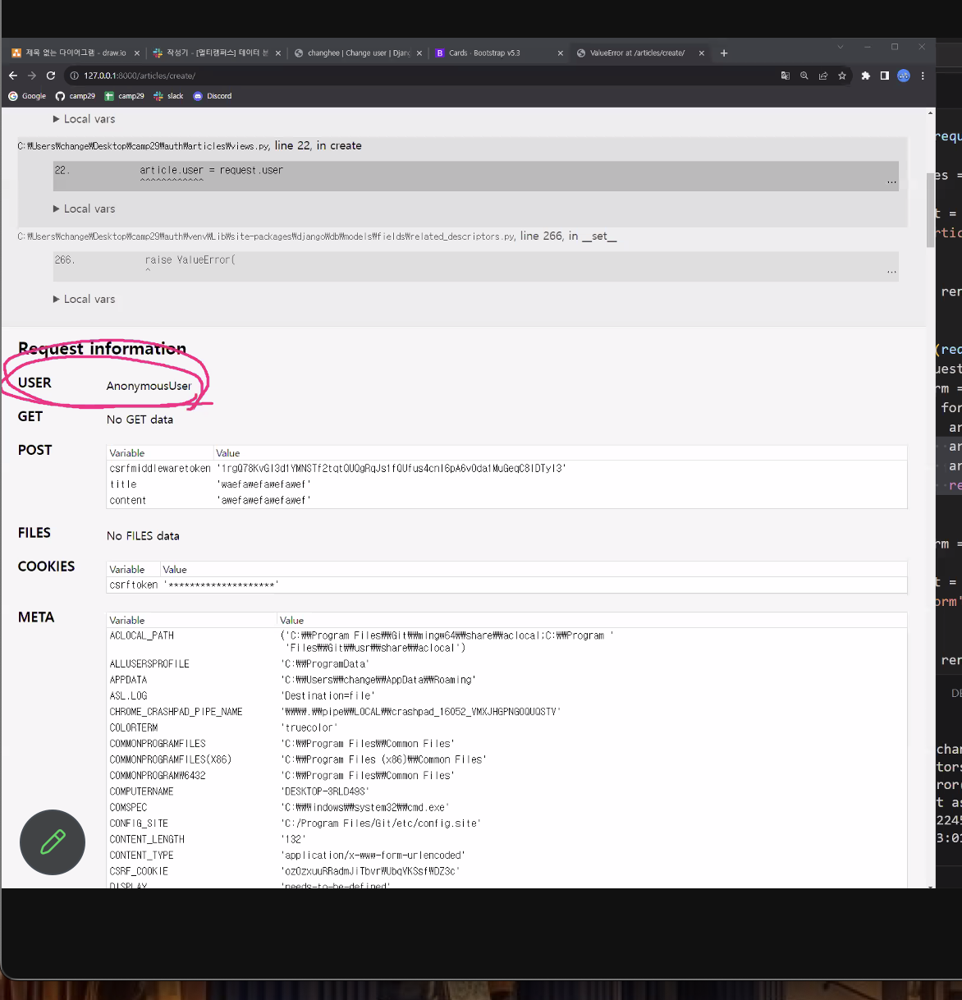

### makemigrations -> migrate 유의사항

migrate 를 하지않으면 실제 표가 생기지 않음
- 이미 makemigrations 로 0001, 0002, 0003 을 만들어 놓고 migrate를 실행해도 됨.

** 만약 두번째 makemigrations를 했을 때 에러가 발생할 경우
(에러가 발생하는 이유는 이미 db표에 데이터가 있는데 새로운 칼럼에 어떤 데이터에 Null 데이터를 넣으면 안되기 때문)
1. DB를 삭제해서 데이터들을 지우고 생성을 해도 되는 경우
- migrations 폴더 안의 파일과 db를 삭제한 후 다시 migrations를 한다.

2. DB를 삭제하면 안되는 경우(회원가입을 이미 진행해서 회원들이 있는데 새로운 정보(기능)만 추가하고 싶은 경우)
- 어떤 값이든지 default 값을 넣어주거나
- Field() 안에 blank=True 혹은 null=True 를 넣어주어야 함.


### article views.py


Article class 를 보면 
게시물을 작성하기 위해서는 모든 컬럼이 다 채워져야함(title, content, user) 



경로를 아는 누군가가 url에 articles/create/를 넣고 게시물 실행을 하게 되면 에러가 발생할 수 있음. 
1. 첫번째 방법
- if 문으로 막아줘야함.
```
if not request.user.is_authenticated:
    return redirect('accounts:login')
```
2. 두번째 방법 @login_required 

이상한 경로로 통하는 것을 막기 위한 코드도 짜봐야함.

### 커스터마이징 

django-bootstrap v5 설치후 html 커스터마이징 가능

### freeze


`pip list`

`pip freeze`: 설치된 라이브러리와 버전이 출력됨.

`pip freeze >> requirements.txt`
pip freeze 의 출력 값들이 requirement.txt에 저장된다.

`pip install -r requirement.txt`
- requirement.txt를 기준으로 다 다운로드 받아줌.